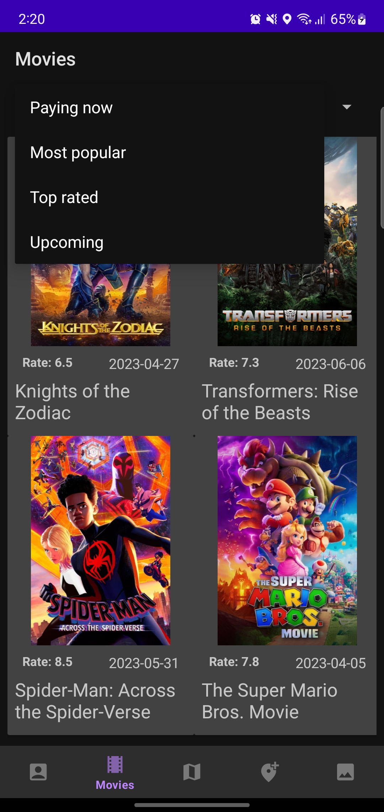

# Openpay Test

This project implements MVVM architecture , StatesFlows to communication between viewmodel and view, coroutines to implement async tasks, retrofilt to consume web apis , Room to local data persistence and some functionalities from Firebase as Cloud firestore to storage user location data and Firebase storage to storage user images
## Requirements

- Android API 21 or higher
- Programming Language: Kotlin

## Project Setup

1. Clone the repository to your local machine:
 
  ```sh
  Git clone https://github.com/neryto/OpenpayTest.git
  ```
2. Open the project in Android Studio.

3. Sync the project dependencies.

   ## Overview

This project is a mobile application for Android devices that consumes a REST API service provided by The Movie Database (TMDB) to fetch movie information. The application is developed using the Kotlin programming language and makes use of Android compatibility libraries.

## Features

1. TMDB REST API Consumption:
- Consumes the TMDB REST API service to retrieve movie data.

2. Local Data Persistence:
- The data obtained from the TMDB service is stored locally for offline access.
- The application displays the locally stored data when the device is offline.

3. Main Activity and Fragments:
- The application includes a main activity and utilizes fragments to display different functionalities.

4. Bottom Navigation:
- Upon launching the application, a Bottom Navigation with 5 options is displayed.

 - Screen 1: Profile Screen
   - Displays user information.
   - Allows viewing user rated movies.
     
  

 - Screen 2: Movie List
   - Loads a list of all movies.
   - Displays paying now, most popular , top-rated , and upcoming movies.
  
     
   
   
   


 - Screen 3: Map of Locations
   - Consumes data from Firebase console (Cloud Firestore).
   - Displays locations on a map.
   - Shows the storage date for each location.


   
   

 - Screen 4: Get user location
   - Get device location and add it to Firebase (Cloud Firestore) every 5 minutes.
   - Show a notification when a location were successfuly regisred.
  
   
   
  
- Screen 5: Image Capture and Upload
   - Allows selecting images from the device gallery.
   - Uploads the images to Firebase Storage.
 
    
   
   

   
5. Implement Firebase Cloud and storage:
- Adds the device location to  Firebase (Cloud Firestore) every 5 minutes.
- Allow staorage a user image from device gallery to Firebase Storage.

    
    


  ## Netx steeps
   - Implement unit test into viewmodels
   - Add doamin layer 

  ## Contact

If you have any questions or a pice of advice to improve this project, you can contact Nery Bustos at nery.h.bustos@gmail.com.

